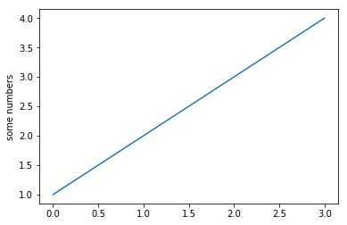

# Inaugural Address Project

by Na-Rae Han

## 0. Introduction
... ...

## 1. Background
... ...

## 2. Data sourcing
... ...

## 3. Data cleanup
... and here I am, pointing to a [particular section of my code](process_data.md#second-section). Note that I am linking a section of the __Markdown version__ (`.md`) of my code, not the Jupyter Notebook file (`.ipynb`). 

## 4. Analysis
... Again, make sure to link to [relevant sections of your code](process_data.md#third-section). Plots can be embedded too, like below. Click the `Raw` button above to see my Markdown source code. 

## 5. Conclusion
... ...
